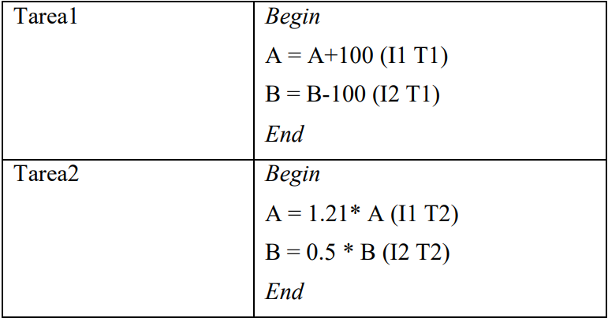
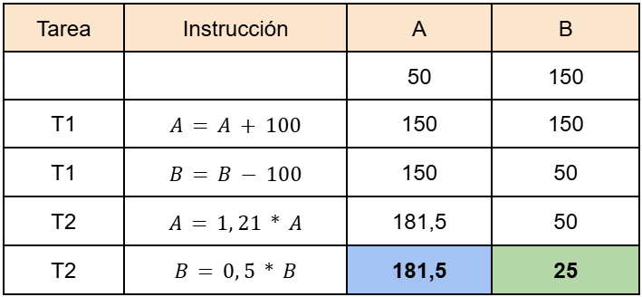
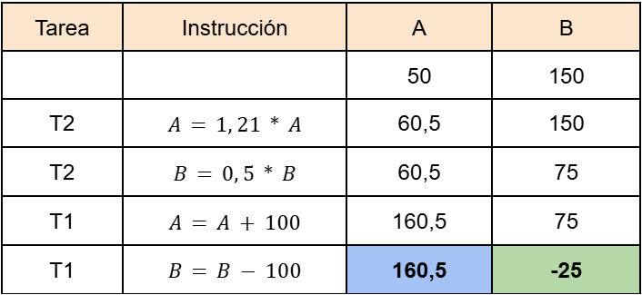
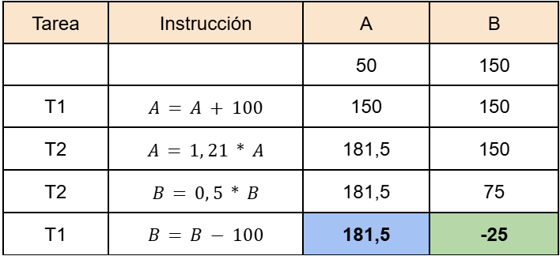
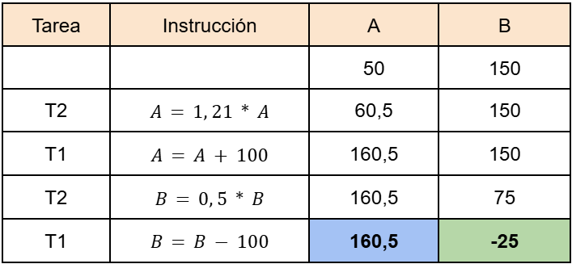
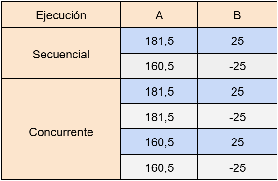

[IC](INTRODUCCION-CONCURRENCIA.md) Actividad 1 | [2](ACTIVIDAD2.md) | [3](ACTIVIDAD3.md) | [4](ACTIVIDAD4.md) | [5](ACTIVIDAD5.md) | [6](ACTIVIDAD6.md) | [7](ACTIVIDAD7.md) | [8](ACTIVIDAD8.md)
# Actividad 1
Suponga que dos tareas deben realizar las siguientes acciones:
  
Si A inicia en 50 y B inicia en 150, indique mediante una tabla el resultado de la ejecución 
secuencial, primero Tarea1 y luego Tarea2, y viceversa. A continuación, suponga que ambas 
tareas se ejecutan de manera simultánea, indique el orden de ejecución de cada instrucción 
teniendo en cuenta todas las combinaciones posibles de las mismas, e indique el resultado 
final de cada variable (A y B) al finalizar cada combinación.
## Desarrollo
## Ejecución Secuencial

## Ejecución Simultanea

## Comparación de Resultados

