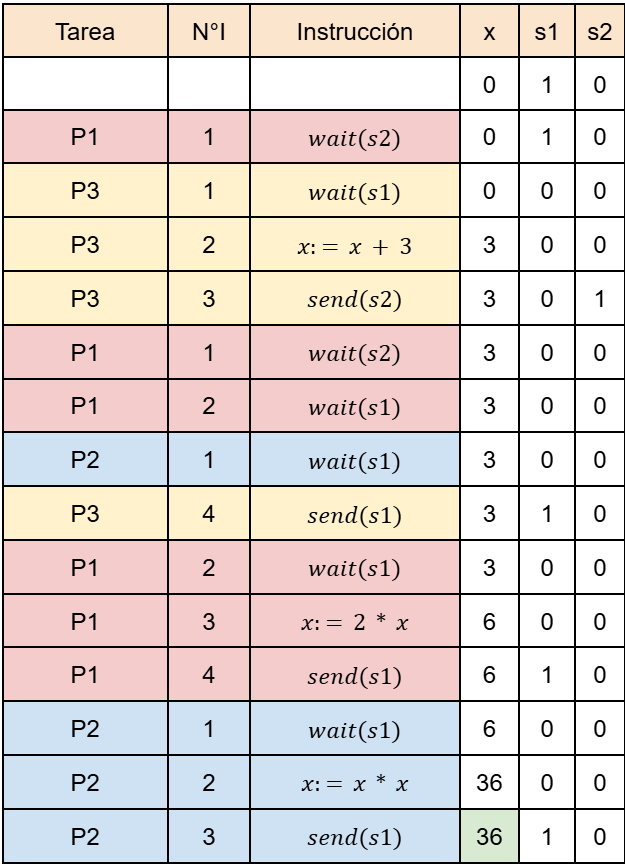
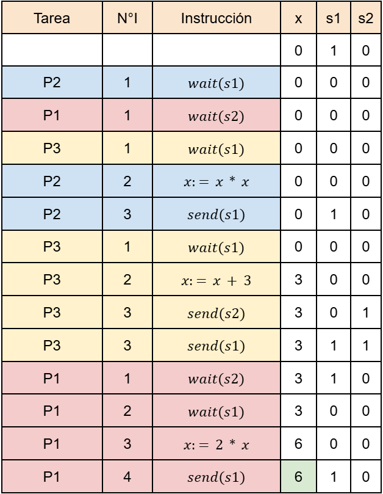
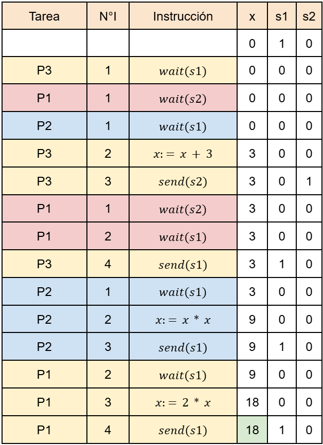

[IC](INTRODUCCION-CONCURRENCIA.md) Actividad [1](ACTIVIDAD1.md) | 2 | [3](ACTIVIDAD3.md) | [4](ACTIVIDAD4.md) | [5](ACTIVIDAD5.md) | [6](ACTIVIDAD6.md) | [7](ACTIVIDAD7.md) | [8](ACTIVIDAD8.md)
# Actividad 2
Considerando el siguiente programa concurrente, calcular para él, el conjunto de los posibles 
valores finales para la variable x. 

## Desarrollo
A continuación, mediante pruebas de escritorio, se muestran algunos casos de ejecución posibles:
### Caso 1

### Caso 2

### Caso 3

### Conjunto de Valores Finales para la Variable x : {6,18,36}
