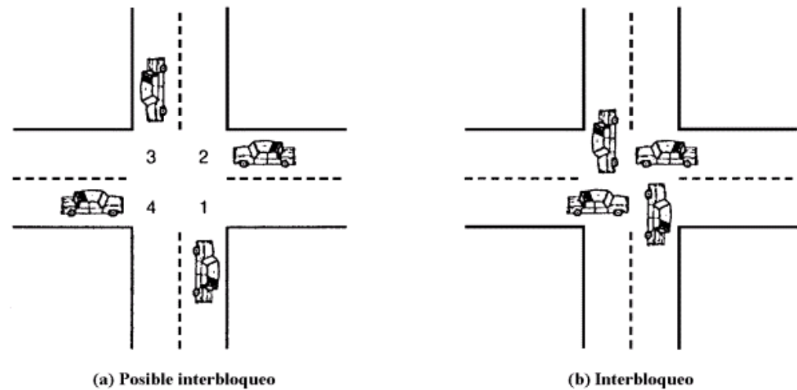

[IC](INTRODUCCION-CONCURRENCIA.md) Actividad [1](ACTIVIDAD1.md) | [2](ACTIVIDAD2.md) | 3 | [4](ACTIVIDAD4.md) | [5](ACTIVIDAD5.md) | [6](ACTIVIDAD6.md) | [7](ACTIVIDAD7.md) | [8](ACTIVIDAD8.md)
# Actividad 3
En la siguiente imagen, extraída de un cruce de calles, cada auto desea seguir su ruta (a), y de 
no tener algún mecanismo de orden o control se producirá un choque, traducido, un 
interbloqueo (b). 
Los cuatro cuadrantes de la intersección son los recursos compartidos sobre los que se 
demanda control, si los cuatro coches desean atravesar el cruce, las necesidades de recursos 
son las siguientes:
* El coche que va hacia el norte necesita los cuadrantes 1 y 2
* El coche que va hacia el oeste necesita los cuadrantes 2 y 3
* El coche que va hacia el sur necesita los cuadrantes 3 y 4
* El coche que va hacia el este necesita los cuadrantes 4 y 1
<br>
Implemente mediante pseudocódigo una rutina que permita la circulación de los autos y evite 
el interbloqueo, para ello debe emplear semáforos como mecanismo de sincronización, y debe 
identificar cada auto por el sentido hacia donde desea ir (N, S, E y O).
## Desarrollo
### Rutina propuesta para una única ejecución
``` 
    semaforo cuadrante1 = 0
    semaforo cuadrante2 = 1
    semaforo cuadrante3 = 0
    semaforo cuadrante4 = 1

    Coche_Norte         | Coche_Este          | Coche_Sur           | Coche_Oeste
    wait(cuadrante2)    | wait(cuadrante1)    | wait(cuadrante4)    | wait(cuadrante3)
    // cruzando 1 y 2   | wait(cuadrante4)    | // cruzando 3 y 4   | wait(cuadrante2)
    signal(cuadrante1)  | // cruzando 4 y 1   | signal(cuadrante3)  | // cruzando 2 y 3
    signal(cuadrante2)  | signal(cuadrante4)  | signal(cuadrante4)  | signal(cuadrante2)
```
### Rutina propuesta para una ejecución repetitiva
```
    semaforo cuadrante1 = 0
    semaforo cuadrante2 = 0
    semaforo cuadrante3 = 0
    semaforo cuadrante4 = 0
    semaforo cocheNorte = 1
    semaforo cocheSur = 1

    Coche_Norte         | Coche_Este          | Coche_Sur           | Coche_Oeste
    wait(cocheNorte)    | wait(cuadrante1)    | wait(cocheSur)      | wait(cuadrante3)
    // cruzando 1 y 2   | wait(cuadrante4)    | // cruzando 3 y 4   | wait(cuadrante2)
    signal(cuadrante1)  | // cruzando 4 y 1   | signal(cuadrante3)  | // cruzando 2 y 3
    signal(cuadrante2)  | signal(cocheSur)    | signal(cuadrante4)  | signal(cocheNorte)
```

