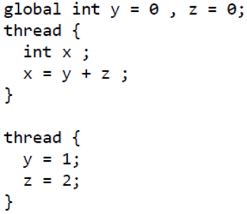

[IC](INTRODUCCION-CONCURRENCIA.md) Actividad [1](ACTIVIDAD1.md) | [2](ACTIVIDAD2.md) | [3](ACTIVIDAD3.md) | [4](ACTIVIDAD4.md) | 5 | [6](ACTIVIDAD6.md) | [7](ACTIVIDAD7.md) | [8](ACTIVIDAD8.md)
# Actividad 5
 Cuáles son los posibles valores de x. 

## Desarrollo
