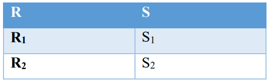

[IC](INTRODUCCION-CONCURRENCIA.md) Actividad [1](ACTIVIDAD1.md) | [2](ACTIVIDAD2.md) | [3](ACTIVIDAD3.md) | [4](ACTIVIDAD4.md) | [5](ACTIVIDAD5.md) | 6 | [7](ACTIVIDAD7.md) | [8](ACTIVIDAD8.md)
# Actividad 6
Existen 2 procesos concurrentes donde S no puede ejecutar S2 hasta que R haya ejecutado R1. 
¿Cuantos semáforos deberías emplear y en que valores los deberías inicializar? ¿Dónde 
pondrías las operaciones wait() y signal()?<br>

## Desarrollo
### Rutina propuesta
``` 
    semaforo s = 0

    R         | S
    R1        | S1
    signal(s) | wait(s)
    R2        | S2
```
Con un semáforo es suficiente para controlar la ejecución del código en el orden indicado. 
La operación wait() se ubica antes de S1 y el signal() despues de R1.
