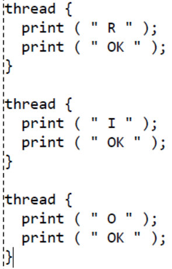

[IC](INTRODUCCION-CONCURRENCIA.md) Actividad [1](ACTIVIDAD1.md) | [2](ACTIVIDAD2.md) | [3](ACTIVIDAD3.md) | [4](ACTIVIDAD4.md) | [5](ACTIVIDAD5.md) | [6](ACTIVIDAD6.md) | 7 | [8](ACTIVIDAD8.md)
# Actividad 7
Considere los siguiente hilos 
 
Empleando semáforos, se debe asegurar que el resultado final de la impresión sea “R I O OK
OK OK”.
## Desarrollo
